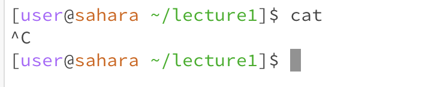
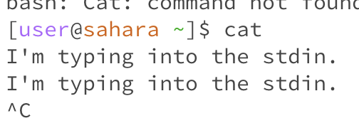
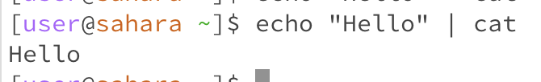
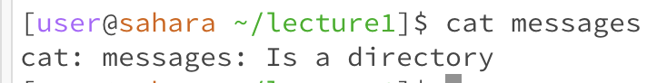
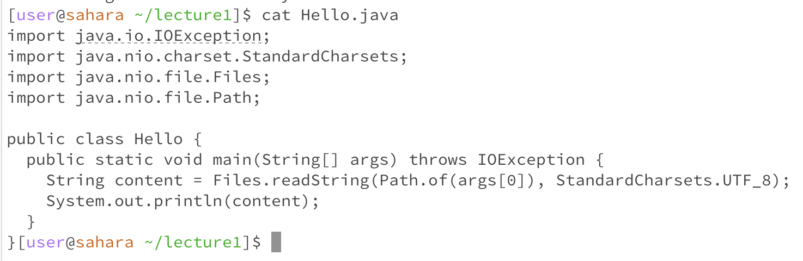
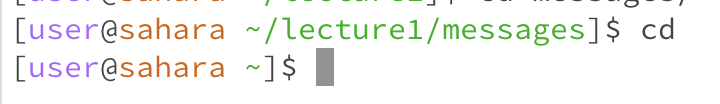
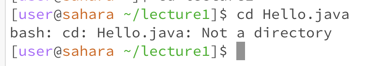
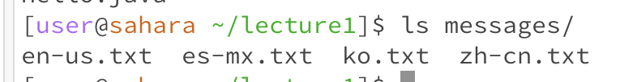
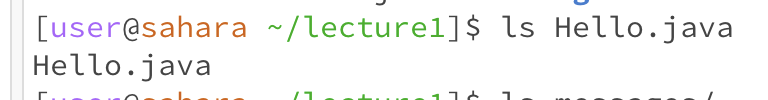

# CAT
## CAT (no argument)


```sh
cat
```



**Working directory:** ~/lecture1

**Why this output:** Since we didn't receive argument, it is reading from standard input. It looks like it's hanging and that's why I escaped it by Ctrl-C, but it was waiting for the input to come.

If I actually provide input through stdin by typing or piping into stdin (`| operator`), we can see that it outputs them like below.





I've found this stackoverflow article on why cat without argument was defined to work in this way: [stackoverflow post](https://retrocomputing.stackexchange.com/questions/26641/why-does-cat-with-no-argument-read-from-standard-input)
TLDR: "cat" was invented before "echo" in order to put human input into stdin.

Nowadays, people define these types of commands that receive from stdin if no argument was specified as "filter family." (e.g. cat, cut, grep, sed, tee, etc)

**Is this error:** It can be considered error, but it is actually doing what it was designed to do: printing out the content of "file."

## CAT (directory)

```sh
cat messages
```



**Working directory:** ~/lecture1

**Why this output:** Since it received directory instead of file, it errored out.

**Is this error:** Yeah, it said that it is an error.

## CAT (file)

```sh
cat Hello.java
```



**Working directory:** ~/lecture1

**Why this output:** Cat is doing its job: printing out the file content.

**Is this error:** No.

# CD
## CD (no argument)
```sh
cd
```



**Working directory:** ~/lecture1/messages

**Why this output:** It's changing working directory to home directory. If you look at the documentation of cd, it is actually defined to work this way: "If no directory operand is given and the HOME environment variable is set to a non-empty value, the cd utility shall behave as if the directory named in the HOME environment variable was specified as the directory operand."

**Is this error:** It is not an error since it's doing what it was defined to do.

## CD (directory)

```sh
cd lecture1
```


**Working directory:** ~

**Why this output:** Since it received valid directory argument, it's changing working directory to 'lecture1.'

**Is this error:** No.

## CD (file)

```sh
cd Hello.java
```



**Working directory:** ~/lecture1

**Why this output:** Since it received file instead of directory, it is erroring out.

**Is this error:** Yeah, it's saying it is an error.

# LS
## LS (no argument)
```sh
ls
```


**Working directory:** ~/lecture1

**Why this output:** It is showing the list of files of the current working directory, which is how it supposed to work according to documentation: "If no operands are given, the contents of the current directory are displayed."

**Is this error:** No.

## LS (directory)

```sh
ls messages
```



**Working directory:** ~/lecture1

**Why this output:** It is showing the list of files of the directory "messages."

**Is this error:** No.

## LS (file)

```sh
ls Hello.java
```



**Working directory:** ~/lecture1

**Why this output:** Since it received file instead of directory, it is erroring out.

**Is this error:** Yeah, it's saying it is an error.


