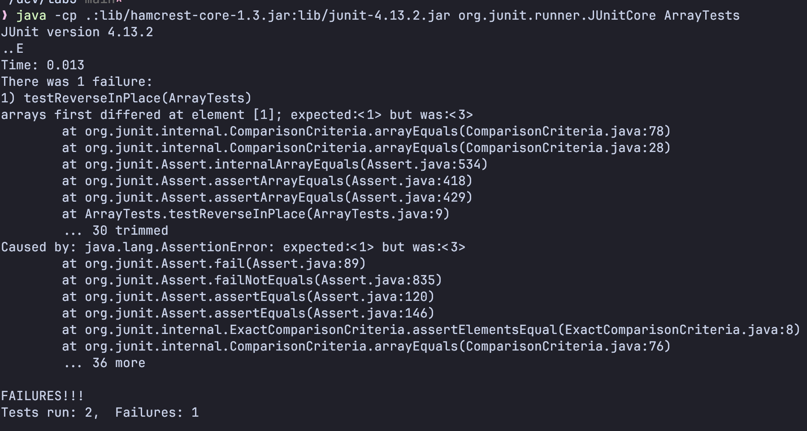
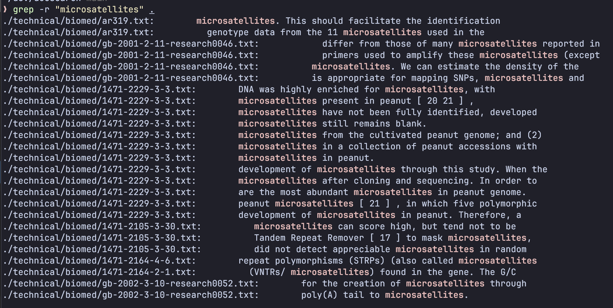
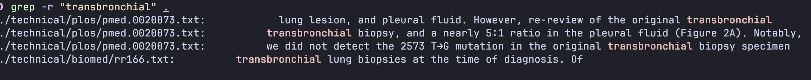
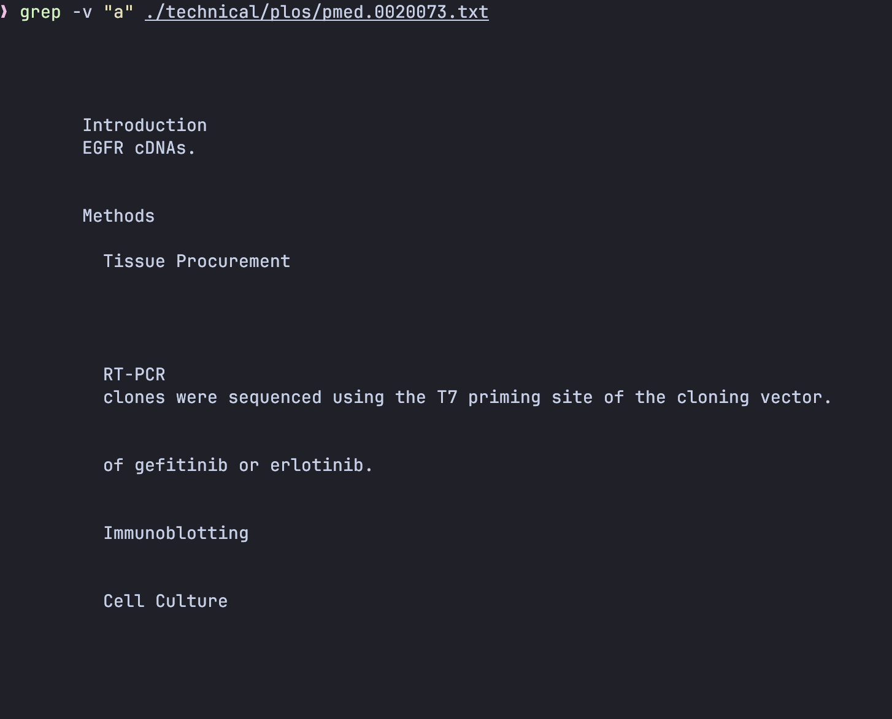
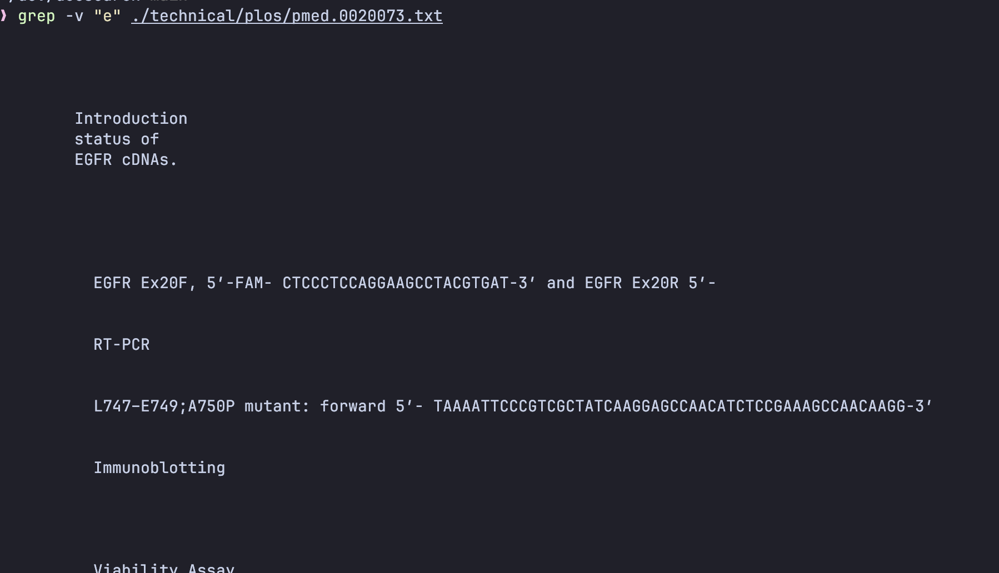
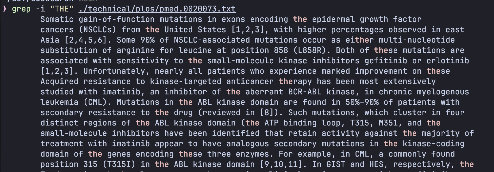
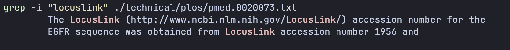
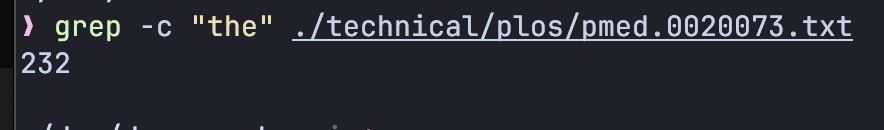
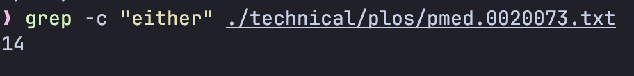

# Part 1


Fail 
```java
@Test
public void testReverseInPlace() {
  int[] input1 = { 1, 3 };
  ArrayExamples.reverseInPlace(input1);
  assertArrayEquals(new int[] { 3, 1 }, input1);
}
```

No fail
```java
@Test
public void testReverseInPlace() {
  int[] input1 = { 1 };
  ArrayExamples.reverseInPlace(input1);
  assertArrayEquals(new int[] { 1 }, input1);
}
```
Symptom: Array \[1, 3\] is not properly reversed as \[3, 1\]


Bug: The code is overwriting the array before when the element is needed.
Fix: Swap elements instead of overwriting

Before 
```java
  static void reverseInPlace(int[] arr) {
    for(int i = 0; i < arr.length; i += 1) {
      arr[i] = arr[arr.length - i - 1];
    }
  }
```

After
```java
  static void reverseInPlace(int[] arr) {
    for(int i = 0; i < arr.length/2; i += 1) {
      int tmp = arr[i];
      arr[i] = arr[arr.length - i - 1];
      arr[arr.length - i - 1] = tmp;
    }
  }
```

This fixes the bug since now it doesn't overwrite the first element before it is needed; it's swapped to the correct place now.

## Part 2

All descriptions of command line option were from man grep.

**grep -r:** performs recursive search on the directory specified.





**grep -v:** find all lines that does not include specified word.





**grep -i:** perform case-insensitive search.





**grep -c:** count number of matching lines.






