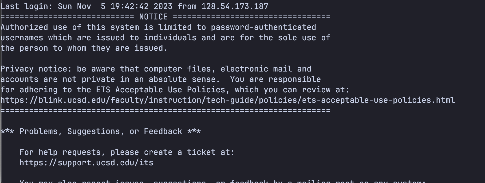
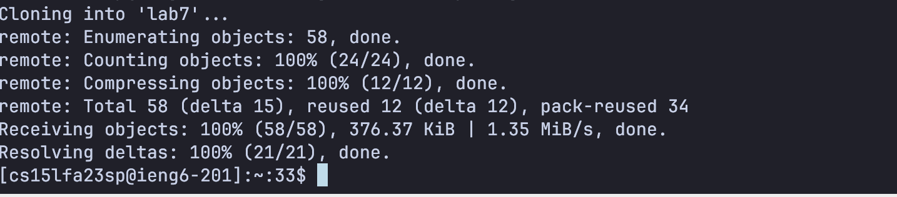
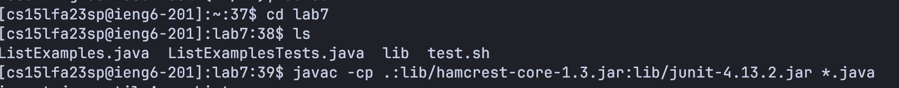
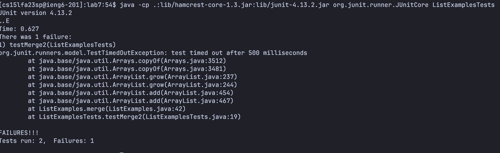
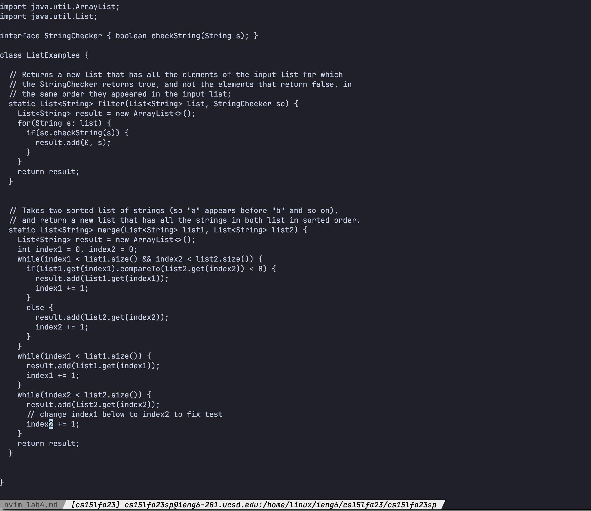
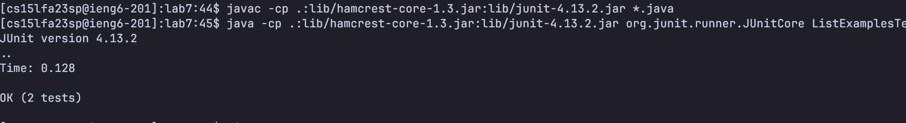
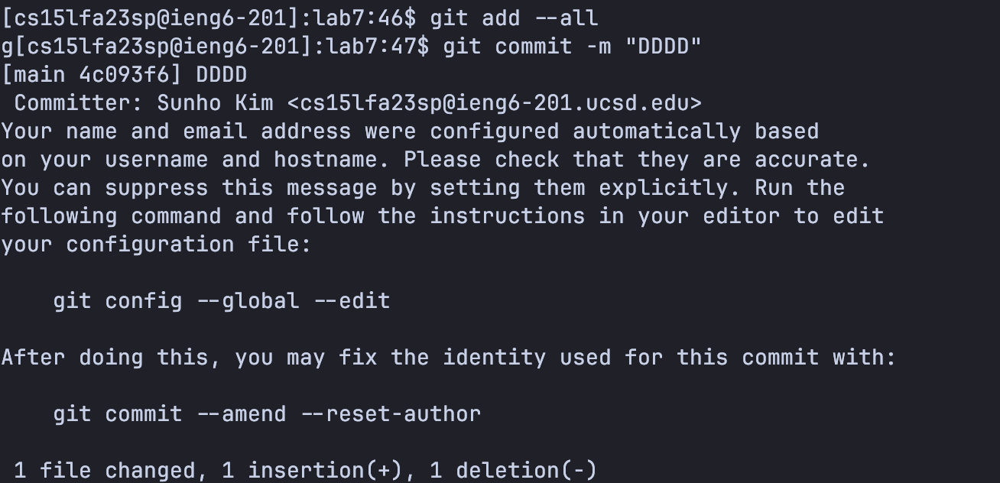
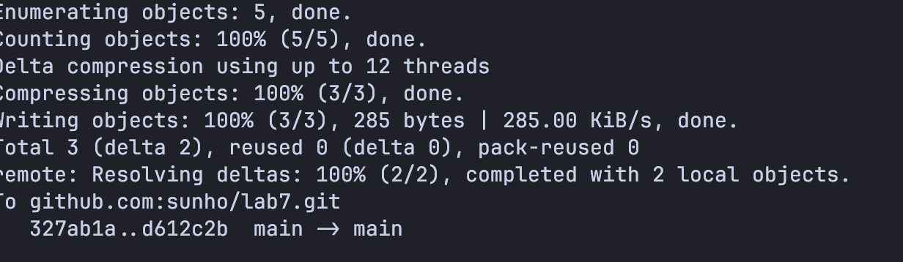

# Step 4
Key pressed: `ssh cs15lfa23sp@ieng6.ucsd.edu<enter> to connect to used server`

# Step 5
Key prssed: `git clone git@github.com:sunho/lab7.git to clone the repo`

# Step 6
Key pressed: `cd lab7<enter>` (change directory)

`javac -cp .:lib/hamcrest-core-1.3.jar:lib/junit-4.13.2.jar *.java<enter>` (compile)

`java -cp .:lib/hamcrest-core-1.3.jar:lib/junit-4.13.2.jar org.junit.runner.JUnitCore ListExamplesTest` (run)

# Step 7
Key pressed: `vim ListExamples.java<enter>` (open vim)

`G6jf1r2:x<enter>` (move to last line, move up 6 to up, go to the first character "1", replace it with 2, save the file and exit)

# Step 8
Key pressed: `<up><up><up><up><enter> to do last javac command` (compile)

`<up><up><up><up><enter> to do java command` (run)

# Step 9
`Key pressed: git add --all<enter>git commit -m "Random commit message"<enter>git push to push changes to remote`

